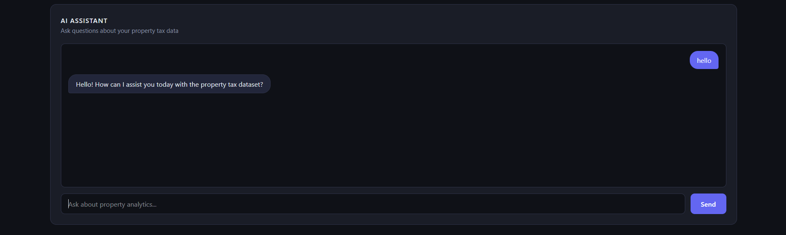

# UPYOG Property Tax Analytics Dashboard

A multi-tenant property tax analytics dashboard for the UPYOG platform, serving 10 Indian cities. Built with React (frontend) and Node.js/Express (backend), with an AI chat assistant powered by OpenRouter.

---

## Tech Stack

- **Frontend** — React + Vite + Recharts + Tailwind CSS
- **Backend** — Node.js + Express
- **Data** — `properties.json` (1,000 records, loaded directly — no database required)
- **AI** — OpenRouter API (`openai/gpt-3.5-turbo`)

---

## Project Structure

```
tax-analytics/
├── client/                   # React frontend
│   └── src/
│       ├── components/
│       │   ├── Navbar.jsx
│       │   ├── KPICards.jsx
│       │   ├── TenantFilter.jsx
│       │   ├── CollectionChart.jsx
│       │   ├── StatusChart.jsx
│       │   └── ChatAssistant.jsx
│       └── services/
│           └── api.js
└── server/                   # Express backend
    └── src/
        ├── routes/
        │   ├── propertyRoutes.js
        │   └── ChatRoute.js
        ├── db/
        │   ├── db.js           # PostgreSQL pool (optional)
        │   └── schema.sql      # Table definition (optional)
        ├── data/
        │   └── properties.json # 1,000 property records
        ├── index.js
        └── seed.js             # DB seeding script (optional)
```

---

## Prerequisites

- Node.js v18+
- npm
- PostgreSQL (optional — only needed for bonus DB mode)

---

## Setup (Default — No Database Required)

### 1. Clone the repository

```bash
git clone <your-repo-url>
cd tax-analytics
```

### 2. Configure environment variables

```bash
cd server
cp .env.example .env
```

Open `server/.env` and fill in:

```env
OPENROUTER_API_KEY=your_openrouter_api_key_here
ALLOWED_ORIGIN=http://localhost:5173
USE_DB=false
```

Get a free OpenRouter API key at [openrouter.ai](https://openrouter.ai).

### 3. Install and start the backend

```bash
cd server
npm install
npm run dev
```

The server starts at `http://localhost:3000`.

### 4. Install and start the frontend

Open a new terminal:

```bash
cd client
npm install
npm run dev
```

The app opens at `http://localhost:5173`.

---

## Bonus — PostgreSQL Mode

The app supports an optional PostgreSQL backend. When enabled via `USE_DB=true`, all API routes query a live PostgreSQL database instead of the JSON file. The data and results are identical — this demonstrates a production-ready backend.

### 1. Install PostgreSQL

Download and install PostgreSQL from [postgresql.org/download](https://www.postgresql.org/download/).

During installation you will be asked to set a password for the default `postgres` user — remember it.

### 2. Create the database

Open **psql** (the PostgreSQL shell) or **pgAdmin** and run:

```sql
CREATE DATABASE upyog_tax;
```

Using psql from the terminal:

```bash
psql -U postgres
```

```sql
CREATE DATABASE upyog_tax;
\q
```

### 3. Create the table

Run the provided schema file against the new database:

```bash
psql -U postgres -d upyog_tax -f server/src/db/schema.sql
```

This creates the `properties` table with all required columns.

### 4. Configure environment variables

Open `server/.env` and fill in your PostgreSQL credentials:

```env
OPENROUTER_API_KEY=your_openrouter_api_key_here
ALLOWED_ORIGIN=http://localhost:5173

USE_DB=true
DB_HOST=localhost
DB_PORT=5432
DB_USER=postgres
DB_PASSWORD=your_postgres_password
DB_NAME=upyog_tax
```

### 5. Seed the database

This loads all 1,000 records from `properties.json` into PostgreSQL:

```bash
cd server
node src/seed.js
```

You should see:

```
Seeded 1000 records successfully.
```

### 6. Start the server

```bash
npm run dev
```

The server now serves all API responses from PostgreSQL. The frontend requires no changes.

### Verify the data (optional)

To confirm the data loaded correctly, open psql and run:

```bash
psql -U postgres -d upyog_tax
```

```sql
SELECT COUNT(*) FROM properties;
-- Should return 1000

SELECT tenant, COUNT(*) FROM properties GROUP BY tenant ORDER BY tenant;
-- Should show all 10 cities with their record counts
```

---

## Features

### KPI Dashboard
Four live KPI cards that update when a city is selected:
- Total Properties Registered
- Total Properties Approved
- Total Properties Rejected
- Total Collection (₹)

### Tenant Filter
Dropdown with all 10 cities plus an **All Cities** option. Selecting a city filters all KPIs instantly.

### Comparison Charts
- **Collection by City** — bar chart showing total tax collected per city. The selected city's bar is highlighted; all others dim.
- **Status by City** — grouped bar chart showing Approved / Rejected / Pending counts per city side by side.

### AI Chat Assistant
Type a question in plain English and get an answer based on the dataset.

**Example questions:**
- Which city has the highest total collection?
- How many properties are rejected in Mumbai?
- What percentage of Delhi properties are approved?
- Which city has the most pending properties?
- Compare total registrations between Pune and Jaipur.

---

## API Endpoints

| Method | Endpoint | Description |
|--------|----------|-------------|
| GET | `/api/kpis` | Overall KPIs |
| GET | `/api/kpis?tenant=Delhi` | KPIs filtered by city |
| GET | `/api/collection-by-city` | Total collection per city |
| GET | `/api/status-by-city` | Approved/Rejected/Pending per city |
| POST | `/api/chat` | AI chat — body: `{ "message": "..." }` |
| GET | `/health` | Server health check |

---

## Screenshots

**Dashboard**


**AI Chat Assistant**


---

## Notes

- The app works out of the box with no database. Set `USE_DB=false` (or omit it) to use JSON mode.
- Set `USE_DB=true` and follow the PostgreSQL setup above to enable the database backend.
- Never commit your `.env` file. It is already listed in `.gitignore`.
